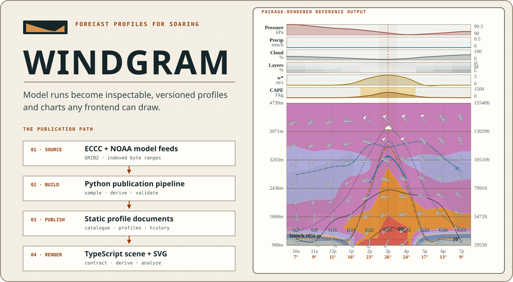

# Windgram



<p align="center">
  <strong>Forecast profiles for soaring, published as data and built to render anywhere.</strong><br>
  A Python publication pipeline, a static JSON contract, and a headless TypeScript toolkit in one repository.
</p>

<p align="center">
  <a href="https://windgram.azohra.com">Live windgrams</a> ·
  <a href="packages/windgram/README.md">Integration guide</a> ·
  <a href="research/README.md">Research</a> ·
  <a href="reference/forecast-model-feeds.md">Feed reference</a> ·
  <a href="sites.json">Site catalogue</a>
</p>

## The whole path, in one repository

Windgram carries a forecast from provider files to an inspectable chart. The layers are independent: use the published profiles without running a builder, bring the typed data into a custom UI, or use the reference renderer end to end.

| Layer | Home | What it provides |
| --- | --- | --- |
| **Python publication pipeline** | [`windgram/`](windgram/) | Fetches ECCC and NOAA model fields, samples each catalogued launch, derives soaring quantities, and publishes current runs plus history. |
| **Static data contract** | [`data/`](data/) | A discoverable model catalogue, manifests, versioned site profiles, and append-only archives. No API key or service dependency. |
| **TypeScript toolkit** | [`packages/windgram`](packages/windgram/) | Zod schemas and types, pure derivations, a serializable scene graph, hit-testing, presets, and the reference SVG renderer. |
| **Reference site** | [`site/`](site/) | A working frontend built from the same public documents and npm package available to every other consumer. |

Profiles include surface conditions, winds and temperatures aloft, thermal velocity, boundary-layer top, cloud base, and usable-lift top. Each model declares its own capabilities; missing fields remain honest absences.

### Use the data directly

```sh
curl -sS https://raw.githubusercontent.com/azohra/windgram/main/data/hrdps-continental/sites/dundee.json \
  | jq '.hours[] | {validAt} + .derived'
```

### Build with TypeScript

```sh
npm install windgram
```

```ts
import { parseWindgramProfileJson } from "windgram/contract";
import { buildScene } from "windgram/scene";
import { renderSvg } from "windgram/svg";

const profileUrl =
  "https://raw.githubusercontent.com/azohra/windgram/main/data/hrdps-continental/sites/dundee.json";
const response = await fetch(profileUrl);
const profile = parseWindgramProfileJson(await response.text());
if (!profile) throw new Error("profile failed contract validation");

const svg = renderSvg(buildScene(profile, { timeZone: "America/Vancouver" }));
```

The [package guide](packages/windgram/README.md) covers the contract, pure derivations, scene graph, theming, presets, ensemble documents, and every export.

## Published data

No API key is required. GitHub’s CDN serves every model through the same paths:

```text
https://raw.githubusercontent.com/azohra/windgram/main/data/models.json
https://raw.githubusercontent.com/azohra/windgram/main/data/<model>/manifest.json
https://raw.githubusercontent.com/azohra/windgram/main/data/<model>/sites/<slug>.json
```

[`data/models.json`](data/models.json) is the discovery catalogue — one entry per model with slug, label, grid, forecast step, run cadence (`runIntervalHours`), horizon, kind, and per-model capabilities — and is authoritative when this table drifts:

| Model path | Grid | Forecast steps | Horizon | Pressure levels | Source |
| --- | ---: | ---: | ---: | ---: | --- |
| `hrdps-west` | 1 km | 1 h | 48 h | 9 | [ECCC experimental feed](https://eccc-msc.github.io/open-data/msc-data/nwp_hrdps/readme_hrdps-datamart-alpha_en/) |
| `hrdps-continental` | 2.5 km | 1 h | 48 h | 14 | [ECCC HRDPS](https://eccc-msc.github.io/open-data/msc-data/nwp_hrdps/readme_hrdps_en/) |
| `hrrr-conus` | 3 km | 1 h | 48 h | 9 | [NOAA HRRR](https://registry.opendata.aws/noaa-hrrr-pds/) |
| `nam-conus-nest` | 3 km | 1 h | 60 h | 9 | [NOAA NAM](https://registry.opendata.aws/noaa-nam/) |
| `rdps` | 10 km | 1 h | 84 h | 14 | [ECCC RDPS](https://eccc-msc.github.io/open-data/msc-data/nwp_rdps/readme_rdps_en/) |
| `nam` | 12 km | 1 h | 84 h | 9 | [NOAA NAM](https://registry.opendata.aws/noaa-nam/) |
| `gdps` | 15 km | 3 h | 240 h | 14 | [ECCC GDPS](https://eccc-msc.github.io/open-data/msc-data/nwp_gdps/readme_gdps_en/) |
| `gfs` | 25 km | 3 h | 384 h | 8 | [NOAA GFS](https://registry.opendata.aws/noaa-gfs-bdp-pds/) |
| `reps` | 10 km | 3 h | 72 h | 5 | [ECCC REPS](https://eccc-msc.github.io/open-data/msc-data/nwp_reps/readme_reps_en/) |
| `geps` | 50 km | 3 h | 384 h | 5 | [ECCC GEPS](https://eccc-msc.github.io/open-data/msc-data/nwp_geps/readme_geps_en/) |

REPS and GEPS are the ensembles: 21 members each, derived independently and published as percentile objects, including per-level ensemble soundings at 1000/925/850/700/500 hPa. The 1 km HRDPS feed is experimental and occasionally unavailable. Both NAM entries carry a `sunset` declaration in the catalogue — NAM retires 2026-10-06 with `rrfs` as its successor. Sites outside a model’s domain have no profile for that model.

## Data contract

`manifest.json` identifies the published model run and its available sites. A publication is identified by (`referenceTime`, `generatedAt`): a new `generatedAt` at the same `referenceTime` means the run was re-published with corrected data, and consumers should re-ingest it; `data/runs.json` indexes every model's current pair in one fetch. Each site profile carries `schemaVersion: 1`, run and site metadata (launch coordinates, altitude, model elevation), a `semantics` block declaring how to read the fields whose meaning varies by provider (`gust`: `"hourMax"` or `"instant"`, present when the model publishes gusts; `precipitation`: `"instantRate"` or `"windowMeanRate"`, always), and every forecast hour in chronological order — day windowing is a renderer concern. Ensemble documents add `run.members`, the member count. Each hour nests three blocks:

- `surface` — SI throughout: pressure in Pa, temperature and dew point in °C, wind in m/s, cloud cover in %, precipitation in mm/h, sensible and latent heat flux in W/m². Where a model publishes them (the catalogue's capabilities say which), optional fields add the 10 m gust in m/s (`semantics.gust` says which flavour), surface-based CAPE and CIN in J/kg, model boundary-layer height in metres **above ground**, and low/mid/high cloud-layer fractions in %;
- `levels` — per pressure level: height, temperature, dew point, wind, and, where the model carries them, vertical velocity in Pa/s and cloud fraction in %;
- `derived` — unsmoothed boundary-layer top, thermal velocity, cloud base, and usable-lift top. `usableLiftTopM` embeds a fixed pilot sink rate of **1.0 m/s** — that convention is part of the published value, not a renderer choice. Every input the derivation needs is itself published, so consumers flying a different polar re-answer it from the same document with `windgram/derive`'s parameterized `usableLiftTopM(inputs, sinkRateMs)`.

Optional fields are additive: absence means the model does not publish the quantity there, never zero, and `schemaVersion` stays 1.

Any numeric position may instead hold an ensemble percentile object `{members, p10, p25, p50, p75, p90}` (plus `ceiledMembers` on the clamped heights). Deterministic models publish numbers; REPS publishes percentile objects in the same positions — switch on shape, never on model name.

Past forecasts are append-only gzip archives, one profile document per line, one file per month of the run's `referenceTime`:

```text
data/<model>/history/<slug>/<YYYY-MM>.jsonl.gz
```

```sh
zcat data/hrdps-continental/history/dundee/2026-08.jsonl.gz | jq -r .run.referenceTime
```

The [forecast model feed reference](reference/forecast-model-feeds.md) records provider paths, schedules, field semantics, and verification dates.

## TypeScript package

[`packages/windgram`](packages/windgram/) is the TypeScript companion, published to npm as `windgram` with subpath exports: `windgram/contract` (zod schemas and types for the documents above), `windgram/derive` (pure functions of published state), and `windgram/scene` + `windgram/svg` (the reference renderer; its golden SVG fixtures are the reference look). The site consumes it; other frontends can too.

## Repository

| Path | Contents |
| --- | --- |
| [`data/`](data/) | Published catalogue, manifests, current profiles, and forecast history |
| [`windgram/`](windgram/) | Provider clients, model builders, derivation, and publishing code |
| [`packages/windgram`](packages/windgram/) | Contract, derivations, and reference renderer (npm `windgram`) |
| [`tests/`](tests/) | Derivation, transport, and publication tests |
| [`research/`](research/) | Methods, interpretation, failures, and uncertainty |
| [`reference/`](reference/) | Dated provider reference |
| [`site/`](site/) | Astro site rendering the articles and live windgrams |

## Run the Python publishers

Python 3.12 and [uv](https://docs.astral.sh/uv/) are required.

```sh
uv run python -m windgram.build       # HRDPS 2.5 km
uv run python -m windgram.build_1km   # HRDPS West 1 km
uv run python -m windgram.build_hrrr  # HRRR 3 km
uv run python -m windgram.build_nam nam-conus-nest  # NAM 3 km CONUS nest
uv run python -m windgram.build_rdps  # RDPS 10 km
uv run python -m windgram.build_nam nam            # NAM 12 km
uv run python -m windgram.build_gdps  # GDPS 15 km
uv run python -m windgram.build_gfs   # GFS 25 km
uv run python -m windgram.build_reps  # REPS 10 km ensemble
uv run python -m windgram.build_geps  # GEPS 0.5° ensemble
uv run pytest
```

The ECCC builders stream whole-domain Datamart GRIB2: each file is fetched into memory, sampled at the catalogued sites, and dropped before the next. That moves real volume — roughly 4–8 GiB per deterministic run and 9–14 GiB per ensemble run. The NOAA builders (HRRR, GFS, NAM) fetch only the needed records by byte range against the `.idx` sidecars. Do not run a builder more often than its model publishes.

## Add a site

Add its slug, name, launch coordinates, and elevation to [`sites.json`](sites.json). The next successful build publishes it for every model whose domain covers the coordinates.

## Licence

ECCC source data is used under the [Environment and Climate Change Canada Data Server End-use Licence](https://eccc-msc.github.io/open-data/licence/readme_en/); derived profiles retain its attribution requirement. NOAA HRRR, GFS, and NAM data are public-domain products distributed through the [Open Data Dissemination program](https://www.noaa.gov/information-technology/open-data-dissemination). Code is [MIT licensed](LICENSE).
