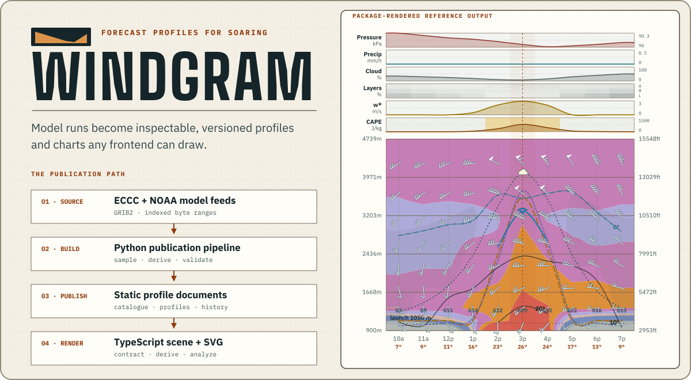
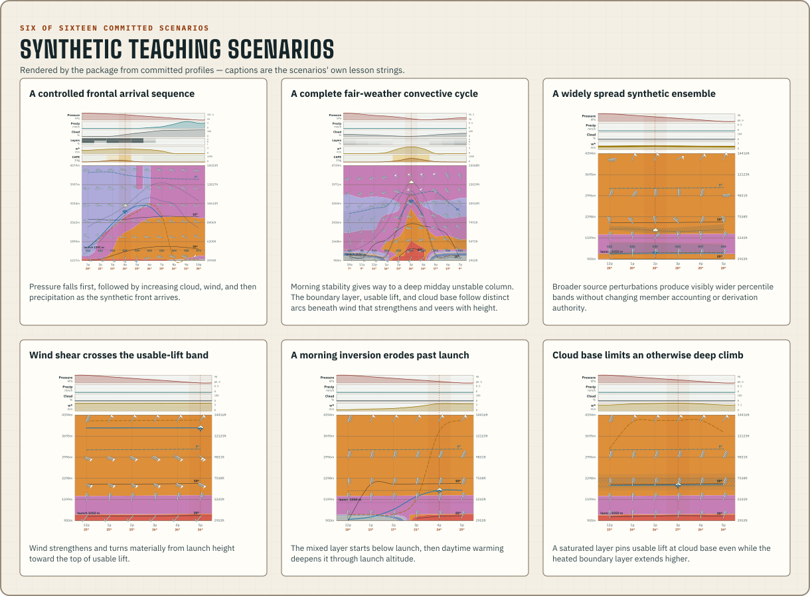

# Windgram



<p align="center">
  <a href="https://www.npmjs.com/package/windgram"></a>
  <a href="https://github.com/azohra/windgram/actions/workflows/ci.yml"></a>
  <a href="https://github.com/azohra/windgram/actions/workflows/build-data.yml"></a>
  <a href="LICENSE"></a>
</p>

<p align="center">
  <strong>An open pipeline and renderer for inspectable free-flight windgrams.</strong><br>
  A Python publication pipeline, a static JSON contract, and a headless TypeScript toolkit in one repository.
</p>

<p align="center">
  <a href="https://windgram.azohra.com">Project site</a> ·
  <a href="https://windgram.azohra.com/docs/overview/">Documentation</a> ·
  <a href="toolkit/README.md">npm package</a> ·
  <a href="https://windgram.azohra.com/research/">Research</a> ·
  <a href="https://windgram.azohra.com/docs/reference/forecast-model-feeds/">Feed reference</a> ·
  <a href="sites.json">Site catalogue</a> ·
  <a href="CHANGELOG.md">Changelog</a> ·
  <a href="CONTRIBUTING.md">Contributing</a>
</p>

Windgram generates versioned profile documents and supplies the tools to validate and render them.
Clubs, pilots, and other downstream publishers decide where, when, and for whom those documents are
presented.

## The whole path, in one repository

Windgram carries a forecast from provider files to an inspectable chart. The layers are independent: use the published profiles without running a builder, bring the typed data into a custom UI, or use the reference renderer end to end.

| Layer | Home | What it provides |
| --- | --- | --- |
| **Python publication pipeline** | [`pipeline/`](pipeline/) | Fetches ECCC and NOAA model fields, samples each catalogued site, derives soaring quantities, and publishes current runs plus history. |
| **Static data contract** | [data.meteo.azohra.com](https://data.meteo.azohra.com/models.json), published from this repo | A discoverable model catalogue, manifests, versioned site profiles, and append-only archives. |
| **TypeScript toolkit** | [`toolkit/`](toolkit/), published to npm as [`windgram`](https://www.npmjs.com/package/windgram) | Zod schemas and types, pure derivations, typed findings, transport guards, a serializable scene graph, hit-testing, the reference SVG renderer, and a scene-derived key. |
| **Project website** | [`site/`](site/) | Documentation, research, and reproducible teaching figures built with the same npm package available to every consumer. |

The rest of the root serves those layers:

| Path | What it is |
| --- | --- |
| [`scenarios/`](scenarios/) | Shared synthetic teaching data: recipes and committed profiles generated by the pipeline, consumed by toolkit goldens, site labs, and doc figures. |
| [`assets/`](assets/) | Repository-level figures, regenerated from the toolkit renderer and drift-checked in CI. |
| [`scripts/`](scripts/) | Cross-layer tooling: regenerates committed doc figures, typechecks documentation code fences against the built toolkit, and rebuilds the cross-language parity fixture. |
| [`sites.json`](sites.json) | The hand-authored site catalogue every builder publishes from: identity and build selection only (slug, name, coordinates, timezone) — humans author WHERE. |
| [`site-context.json`](site-context.json) | The pipeline-measured ground truth for every catalogued site — the launch elevation pick, terrain analysis, and land cover; the pipeline measures WHAT. Written by `windgram terrain`, committed, and published beside the catalogue. |

Profiles include surface conditions, winds and temperatures aloft, thermal velocity, boundary-layer top, cloud base, and usable-lift top. [`models.json`](models.json) declares each model's capabilities and semantics.

### Use the data directly

```sh
curl -sS https://data.meteo.azohra.com/hrdps-continental/sites/dundee.json \
  | jq '.hours[] | {validAt} + .derived'
```

### Build with TypeScript

```sh
npm install windgram
```

```ts
import { parseWindgramProfileJson } from "windgram/contract";
import { buildScene } from "windgram/scene";
import { renderSvg } from "windgram/svg";

const profileUrl =
  "https://data.meteo.azohra.com/hrdps-continental/sites/dundee.json";
const response = await fetch(profileUrl);
const profile = parseWindgramProfileJson(await response.text());
if (!profile) throw new Error("profile failed contract validation");

const svg = renderSvg(buildScene(profile, { timeZone: "America/Vancouver" }));
```

Documents are launch-agnostic — one profile serves every launch its grid
cell covers. To draw a launch marker, pass the launch as a render input,
with the measured elevation from the published
[`site-context.json`](site-context.json):

```ts
buildScene(profile, {
  timeZone: "America/Vancouver",
  launch: { name: "Dundee", elevationM: 1476.4 },
});
```

The [TypeScript documentation](https://windgram.azohra.com/docs/typescript/render-first-windgram/) covers the contract, transport, derivations, analysis, scene graph, rendering tokens, and ensemble documents.

## What the charts teach

[](https://windgram.azohra.com/docs/learn/synthetic-teaching-data/)

Committed [teaching scenarios](https://windgram.azohra.com/docs/learn/synthetic-teaching-data/), rendered by the same package every consumer installs; the [reading guide](https://windgram.azohra.com/docs/learn/reading-a-windgram/) explains every mark on them.

## Published data

The pipeline publishes static profiles for a subset of catalogued launches to
public object storage behind a CDN, at stable paths:

```text
https://data.meteo.azohra.com/models.json
https://data.meteo.azohra.com/<model>/manifest.json
https://data.meteo.azohra.com/<model>/sites/<slug>.json
```

[`models.json`](models.json) is the discovery authority for model
identity, grid, cadence, horizon, kind, capabilities, levels, and lifecycle.
The [forecast model feed reference](https://windgram.azohra.com/docs/reference/forecast-model-feeds/) records
provider sources and verification dates.

The [profile document](https://windgram.azohra.com/docs/reference/profile-document/),
[schemas and units](https://windgram.azohra.com/docs/reference/schemas-and-units/), and
[forecast history](https://windgram.azohra.com/docs/data/history/) references define
the published blocks and identity, validation and units, and the append-only monthly archives.

## Run the Python publishers

Python 3.12 and [uv](https://docs.astral.sh/uv/) are required.

```sh
uv sync --frozen --project pipeline
uv run --project pipeline windgram build --model hrrr-conus --dry-run
uv run --project pipeline pytest pipeline/tests
```

The [publisher documentation](https://windgram.azohra.com/docs/publish/run-one-model/)
covers external site catalogues, output paths, smoke caps, and full builds.
Builders move real provider volume — per-model transports and transfer costs are
recorded in the [feed reference](https://windgram.azohra.com/docs/reference/forecast-model-feeds/) — and must not
run more often than their model publishes.

## Add a site

Add its slug, name, coordinates, and IANA timezone to
[`sites.json`](sites.json) — identity only, nothing physical — then let the
pipeline measure the ground truth:

```sh
uv sync --project pipeline --extra terrain
uv run --project pipeline windgram terrain
```

That regenerates [`site-context.json`](site-context.json) with the site's
launch elevation pick (LidarBC ground returns → MRDEM-30 → GLO-30 as a loud
last resort), terrain analysis, and land cover; commit both files. The next
successful build publishes the site for every model whose domain covers the
coordinates.

## Lineage

Windgram descends from [canadarasp](https://github.com/ajberkley/canadarasp),
which ran this kind of publication for years — the first derivations here
were ports of its constants — and follows
[soaringmeteo](https://soaringmeteo.org/) in publishing open soaring
forecasts. The [about page](https://windgram.azohra.com/about/) has the
fuller account.

## Licence

ECCC source data is used under the [Environment and Climate Change Canada Data Server End-use Licence](https://eccc-msc.github.io/open-data/licence/readme_en/); derived profiles retain its attribution requirement. NOAA HRRR, GFS, and NAM data are public-domain products distributed through the [Open Data Dissemination program](https://www.noaa.gov/information-technology/open-data-dissemination). Code is [MIT licensed](LICENSE).

Release history lives in the [changelog](CHANGELOG.md). Cite a released
repository state with [`CITATION.cff`](CITATION.cff).

Made with <3 by Justin Watts.
